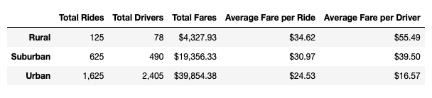
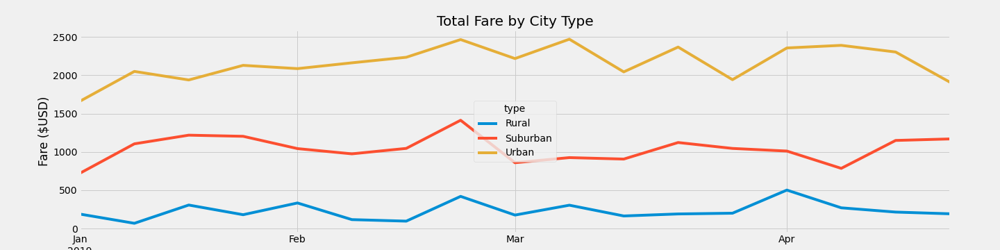

# PyBer Analysis

[Link to Pyber Analysis Code](https://github.com/c-geisel/PyBer_Analysis/blob/main/PyBer_Challenge.ipynb)

## Overview of the analysis
The following project analyzes the company PyBer's data on ride sharing. In this analysis the goal is to create a multiple-line graph that compares the Fare prices of various types of cities depending on the time of the year. In past assignments for this company, analyses have been completed on the data between ride counts, driver counts, and average fare prices based on the type of city. This assignment varies in the aspect that we are incorporating the data across a period of time. To complete this assignment, a summary data frame is created using pandas and then the graph is created using matplotlib. This analysis will assist decision makers address disparities among rural, suburban, and urban cities. 

## Results
To begin this analysis, a data frame is created to obtain the total number of rides, total drivers, total fares, average fare per ride, and the average fare per driver based on the city type. To do this, columns were pulled from the pyber_data_df and then either counted using .count() or added together using .sum(). After this, averages were found, and the values were added and formatted to the pyber_summary_df. 

The following data frame shows that urban cities had the highest number of total rides, drivers, and fares. Suburban cities had the second most of these categories and rural cities had the least amount of these categories. However, the highest average fares per ride and per driver were the in rural cities with second most still being at suburban and the lowest being in urban cities. This can be explained by the fact that there are less rides and less drivers so for them to make a better wage they charge more per ride. In addition to this, rural drivers are most likely driving farther distances and thus charging more per ride. On the opposite end of this spectrum, urban cities can charge less per ride as they are driving shorter distances in a city, and they have more customers and drivers, so prices are kept lower. 

Following the data frame creation, a line graph was created as an additional analysis tool. The goal of the graph was to show the comparison of the fare prices at different months of the year for the various city types. To accomplish this goal, our pyber_data_df was grouped by type and date and the sum of the fare column was found. A pivot table was created with the fare values based on date for city types and then we resampled this data to group by week. From here a line graph was created. 

In the completed line graph below it can be seen that on average, urban cities have the highest total fare, suburban cities have the second highest, and rural cities have the lowest total fare at about 4 times lower than the average for urban cities. All three lines have quite a bit of variability from January to April, but the highest fare prices for all city types is at the end of February, while the lowest total fare prices are around January. The fact that urban cities have such a high total fare as compared to other types of cities can be explained by what was stated about that urban city have more rider traffic and shorter rides leading to a higher total amount of money made. Also, urban cities are more densely populated with less people owning cars leading to more money spent in urban cities. The information that the highest fare is a bit more up for debate. Perhaps this was because February tends to be the coldest time of the year leading more people to want a ride as opposed to walking.

## Summary
To address any disparities among the city types my three business recommendations are as follows:
1. The average fare per rider and per driver is higher when there are a lower number of drivers. Since there was a total of 125 rides and 78 total drivers in rural cities more drivers could be allocated to rural cities in hopes of raising the average fare for these city types. 
2. Based on the low total fare overall in the month of January, an incentive could be provided for riders to encourage higher PyBer usage. Possible incentives could be to offer a discounted ride when they get a friend to ride or offering a free ride for a certain number of rides taken.
3. Being that the end of February is a time of the year where all three types of cities flourished, it would be a good avenue to focus on discovering the reasons why this increase occurred. Whatever factors assisted in the rise of total fares could be applied to lower months of the year to increase overall success.

